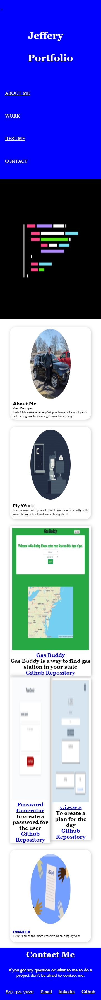
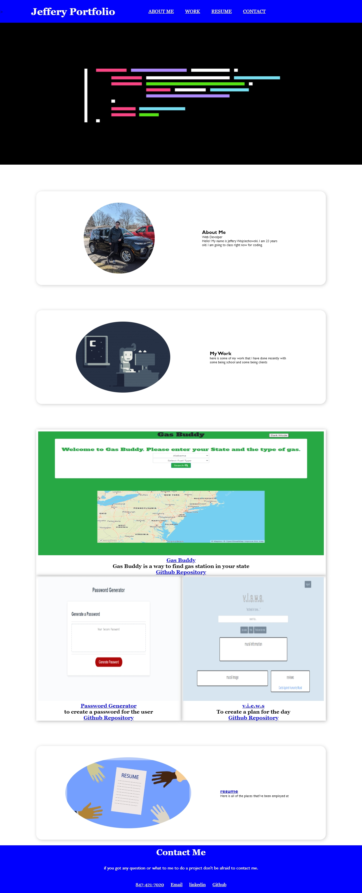

## User Story
___
```
As you grow your small buisness owner
You what you to be able to write and save your idea in your notes
So that your thought is organize
And keep track of the task you need to complete
```

## Table of Contents
---

* [Links](#links)
* [Screenshots/Video](#Screenshots/Videos)
* [Questions](#questions)
* [License](#License)


## Links
___
- [GitHub Repository](https://github.com/Jefferywojo98)
- [Deployed Application](https://jefferywojo98.github.io/Jeffery_Portfolio/)


## Screenshots/Videos
___
Mobile Display   |
:-------------------------:|
  |
 Desktop Display: 

## Questions
___

If you have any questions about the repo you can open an issue on my [Github](https://github.com/Jefferywojo98)

## License
___

Copyright (c) 2021 Jeffery Wojciechowski

Permission is hereby granted, free of charge, to any person obtaining a copy
of this software and associated documentation files (the "Software"), to deal
in the Software without restriction, including without limitation the rights
to use, copy, modify, merge, publish, distribute, sublicense, and/or sell
copies of the Software, and to permit persons to whom the Software is
furnished to do so, subject to the following conditions:

The above copyright notice and this permission notice shall be included in all
copies or substantial portions of the Software.

THE SOFTWARE IS PROVIDED "AS IS", WITHOUT WARRANTY OF ANY KIND, EXPRESS OR
IMPLIED, INCLUDING BUT NOT LIMITED TO THE WARRANTIES OF MERCHANTABILITY,
FITNESS FOR A PARTICULAR PURPOSE AND NONINFRINGEMENT. IN NO EVENT SHALL THE
AUTHORS OR COPYRIGHT HOLDERS BE LIABLE FOR ANY CLAIM, DAMAGES OR OTHER
LIABILITY, WHETHER IN AN ACTION OF CONTRACT, TORT OR OTHERWISE, ARISING FROM,
OUT OF OR IN CONNECTION WITH THE SOFTWARE OR THE USE OR OTHER DEALINGS IN THE
SOFTWARE.